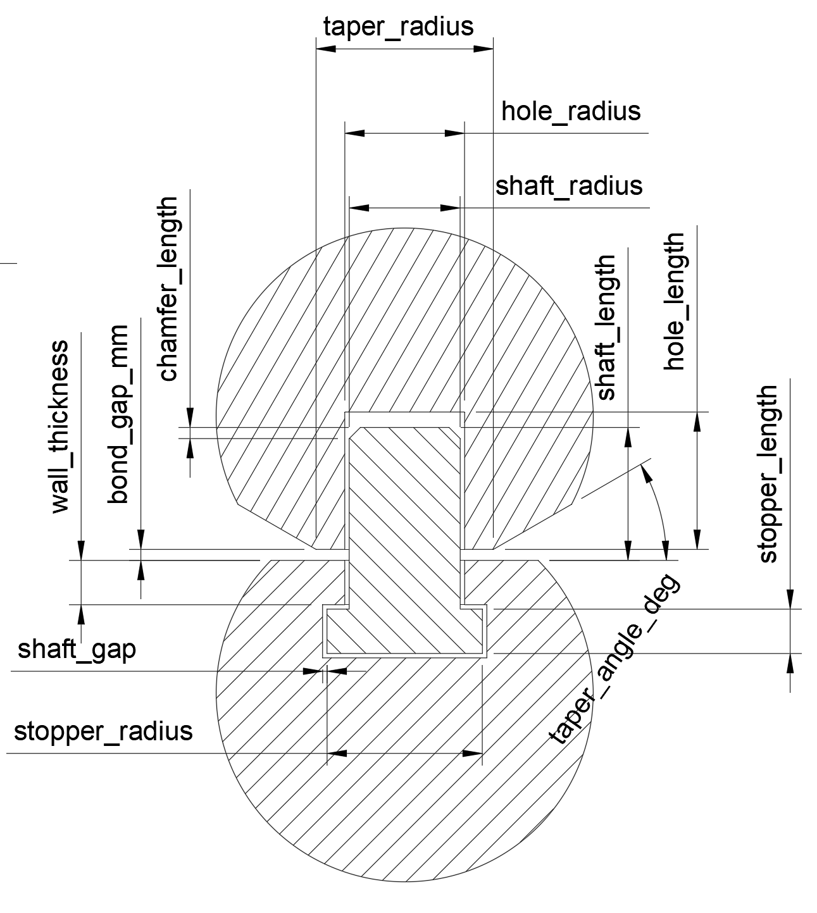

# molfidget

molfidget（モルフィジェット）は、3Dプリンタで印刷できる分子模型を、簡単に出力できるpythonプログラムです。主な特長は以下のとおりです：

- 単結合が回転可能：分子の立体配座（コンフォメーション）を自由に変化させられます。
- 汎用ファイル形式に対応：.mol や .pdb といった一般的な分子構造ファイルを読み込み、3Dプリンタ用データを自動生成します。
- 一体成形対応：回転軸込みで一体的に形成できるため、複雑な分子構造でも再現可能です。

分子模型として研究や教育に使えるだけでなく、「触って遊べる」フィジェットトイとしても楽しく遊べます。

[](https://youtu.be/yW3nhmGi39I?si=bQ1YR3bFerIw2kXY)

# 実行環境

Ubuntu 24.04以降で動作します。Windows WSL2 でも大丈夫。

# インストール（pipx）

pipxでもインストールすることができます。

```
pipx install molfidget
```

実行ファイル名は`molfidget`です。

# インストール（ソースコードから）

## 必要なツール

```
sudo apt install git libglut-dev python3-poetry
```

## コードを取得

```
cd ~/
git clone https://github.com/longjie0723/molfidget.git
```

## パッケージをインストール

```
cd ~/molfidget
poetry install
```
実行する場合は、以下の`molfidget`コマンドを以下に置き換えてください。

`poetry run molfidet`

# 実行

molfidgetは3つのサブコマンドを持っています:

#### 1. convert - PDB/MOLファイルをMLF形式に変換

```bash
# PDBファイルをMLF形式に変換
molfidget convert data/pdb/ethanol.pdb data/mlf/ethanol.mlf

# 標準出力に出力する場合
molfidget convert data/mol/H2O.mol
```

#### 2. preview - MLFファイルを3Dプレビュー

```bash
molfidget preview data/mlf/ethanol.mlf
```

* 'q'キーでプレビューが終了します
* 'w'キーでワイヤフレーム表示になるので内部を確認できます

#### 3. generate - MLFファイルからSTLファイルを生成

```bash
molfidget generate --scale 10.0 --output-dir output data/mlf/ethanol.mlf
```

* `--scale`: スケール係数（デフォルトはMLFファイルで指定された値）
* `--output-dir`: 出力ディレクトリ（デフォルトは`output`）
* 出力されるファイル:
  * `<分子名>.3mf` - 全体の3MFファイル
  * `<原子名>.stl` - 個別原子のSTLファイル
  * `<元素名>_group.stl` - 元素ごとのマージ済みSTLファイル

### パラメータについて

#### スケール（scale）
* 元のモデルは単位がオングストロームになっているので、scale=1.0だとSTLファイルのモデルはすごく小さくなってしまう
* scale=10.0とかにするとプリント可能なSTLになる
* スケールはMLFファイル内で指定するか、`generate`コマンドの`--scale`オプションで上書きできる

#### 軸ギャップ（bond_gap_mm）
* 可動軸の軸と穴のギャップは、MLFファイルの`default.bond.bond_gap_mm`で指定する
* 単位はmmで、デフォルトは0.2になっている
* 通常の3Dプリンタだとたぶん0.2〜0.3ぐらいの間で問題ない

### 典型的なワークフロー

```bash
# 1. PDBファイルをMLF形式に変換
molfidget convert data/pdb/ethanol.pdb data/mlf/ethanol.mlf

# 2. (オプション) MLFファイルを手動編集してパラメータを調整
# 例: bond_gap_mm, shaft_radius, shape_types など

# 3. プレビューで確認
molfidget preview data/mlf/ethanol.mlf

# 4. STLファイルを生成
molfidget generate --scale 10.0 --output-dir output data/mlf/ethanol.mlf
```

# モデリング

軸、穴部分の形状とパラメータの名前はこのようになっています。



# さらに詳しく

* MLFファイル形式の仕様: [docs/mlf_file.md](docs/mlf_file.md)
* プロジェクト全体のドキュメント: [docs/index.md](docs/index.md)

# 関連記事 (note)

- [2025年ノーベル化学賞のMOFを3Dプリント分子模型で作る](https://note.com/keisuke_tajima/n/n793f8971bdd1)
- [3Dプリント分子模型molfidgetでDNAを作る](https://note.com/keisuke_tajima/n/nb369a40bf219)
- [Molfidgetで作るアミノ酸20種の分子模型](https://note.com/keisuke_tajima/n/nb871895494b0)
- [3Dプリント分子模型molfidgetでシクロヘキサンの環反転を実演するためのtips](https://note.com/keisuke_tajima/n/neb526bf0dd8b)
- [3Dプリンタで作る分子模型molfidget](https://note.com/keisuke_tajima/n/na72e354d478d)