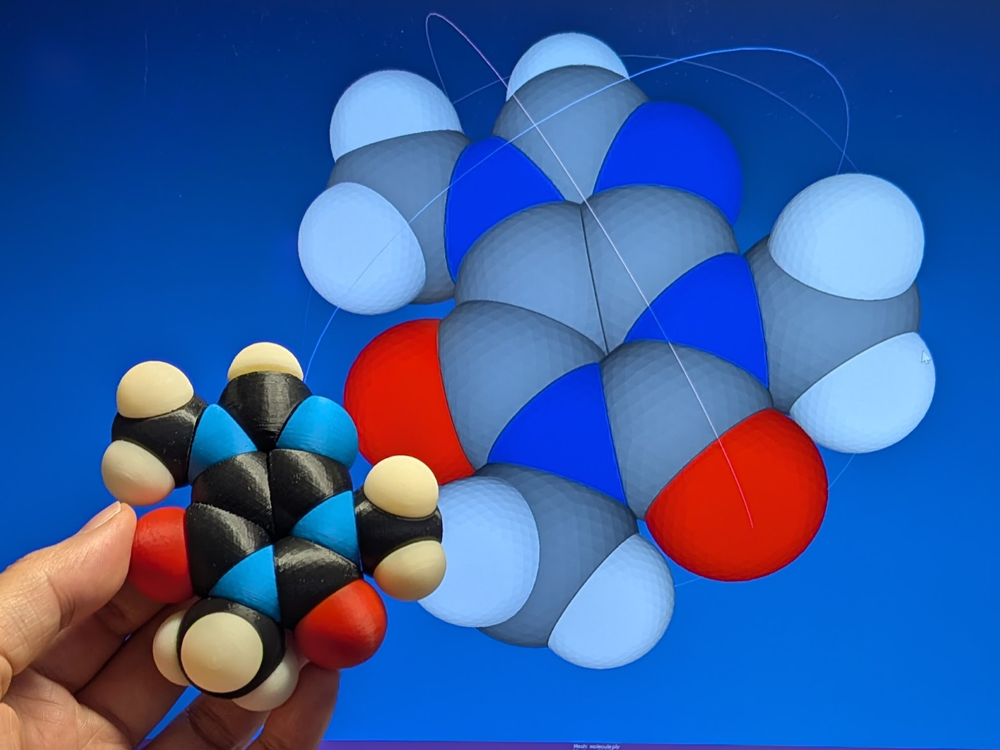

# molfidget ドキュメント

**molfidget** は、分子構造データ（MOL形式・PDB形式）を3Dプリンタで造形可能なSTLファイルに変換するツールです。

## 特徴

- **MOL形式・PDB形式** の分子構造ファイルをサポート
- 分子モデルを3Dプリンタ用のSTLファイルとして出力
- **単結合** を回転軸として可動するようにモデリング可能
- 各種パラメータ（スケール、ギャップなど）をコマンドラインから指定可能

## 主な用途

- 分子模型の3Dプリント
- 教育・研究用途での分子構造の可視化
- 可動式分子モデルの作成

## 使い方

インストールや基本的な使い方については [README.md](../README.md) を参照してください。
